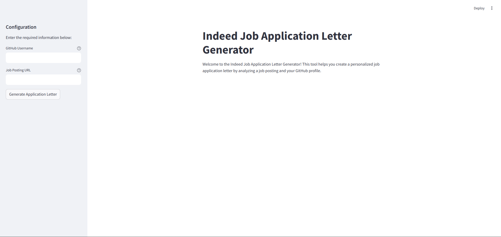

# Indeed Application Letter Generator

## Project Overview

The **Indeed Application Letter Generator** is a tool that automates the creation of personalized job application letters for positions posted on Indeed. By analyzing the job posting and the user's GitHub profile, the application generates a tailored application letter that highlights the user's relevant skills and experiences, aligning them with the job requirements.

## Features

- **Job Posting Analysis**: Extracts key details from Indeed job postings, including job title, requirements, responsibilities, and required experience.
- **GitHub Profile Analysis**: Analyzes the user's GitHub repositories to extract information about projects, technologies used, and areas of expertise.
- **Personalized Application Letter Generation**: Uses advanced language models to generate a customized application letter that emphasizes the user's qualifications and enthusiasm for the position.
- **Interactive User Interface**: Provides a user-friendly interface built with Streamlit for easy input and output of data.

## Interface Preview




## Prerequisites

- **Python 3.9** 
- **GitHub Personal Access Token**
- **Groq API Key**

## Setup and Installation

Follow the steps below to set up and run the application:

### 1. Clone the Repository

```bash
git clone https://github.com/amenallahbenothmen/Indeed-Application-Letter-Generator.git
cd Indeed-Application-Letter-Generator
```

### 2.Create a Virtual Environment

```bash
conda create -n indeed_letter_generator python=3.9
conda activate indeed_letter_generator
```


### 3.Install Dependencies

```bash
pip install -r requirements.txt
```

### 4.Set Up Environment Variables
Create a `.env` file in the **project root directory** with the following content:

```bash
GITHUB_TOKEN='your_github_personal_access_token'
GROQ_API_KEY='your_groq_api_key'
```
### 5. Run the Application

```bash
streamlit run app/main.py
```

## License

This project is licensed under the MIT License - see the [LICENSE](LICENSE) file for details.